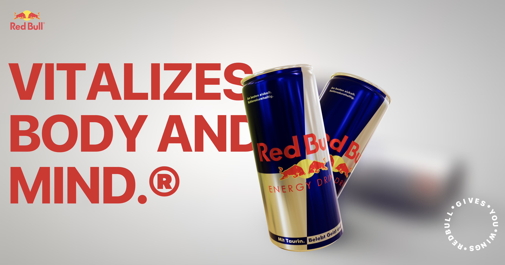

# Red Bull R3F — Interactive 3D + GSAP Landing



<p align="center">
  <a href="https://red-bull-r3-f.vercel.app"></a>
  
  
  
</p>

<p align="center">
  
  
  
  
  
</p>

> A production-ready, animated landing page that combines **React Three Fiber** (3D cans), **GSAP ScrollTrigger** (scroll-driven motion), and **Tailwind CSS**. Deployed on **Vercel** with best-practice bundling and performance tips.

---

## ✨ Highlights

- 🎥 **Scroll-driven storytelling** with GSAP `ScrollTrigger` and `SplitText`
- 🥤 **3D product showcase** using React Three Fiber + `@react-three/drei` (`Float`, `Environment`)
- 🌈 **Cinematic transitions** & staggered text reveals
- ⚡ **Vite** for ultra-fast dev and optimized prod builds
- 🎯 **Production-safe plugin registration** to ensure ScrollTrigger works on Vercel

---


---

## 🧱 Tech Stack

- **Framework**: React 19 + Vite
- **3D**: React Three Fiber, @react-three/drei
- **Animation**: GSAP (ScrollTrigger, SplitText), @gsap/react
- **Styles**: Tailwind CSS
- **Deployment**: Vercel

---

## 📂 Project Structure (key parts)

```
src/
  components/
    Hero.jsx
    About.jsx
    Footer.jsx
    MainCanvas.jsx
    MainScene.jsx
    CircularText.jsx
    CurvedLoop.jsx
  lib/
    gsapSetup.js        # central GSAP plugin registration (ScrollTrigger + SplitText)
public/
  images/
    image.png
    redbull1.png
    redbull2.png
    redbull3.png
    redbull4.png
    lobby.hdr
redbull.glb
```

---

## 🚀 Getting Started

### 1) Install

```bash
pnpm i
# or
npm i
# or
yarn
```

### 2) Dev

```bash
pnpm dev
# or
npm run dev
# or
yarn dev
```

Open http://localhost:5173

### 3) Build

```bash
pnpm build
# or
npm run build
# or
yarn build
```

### 4) Preview (local static preview of the build)

```bash
pnpm preview
# or
npm run preview
# or
yarn preview
```

---

## 🔒 GSAP Setup (production-safe)

Vite’s tree-shaking can drop GSAP plugins in production. **Register them once** in a small module and import from there in your components.

**`src/lib/gsapSetup.js`**

```js
import gsap from "gsap";
import { ScrollTrigger, SplitText } from "gsap/all";

if (!gsap.core?.globals()?.ScrollTrigger) {
  gsap.registerPlugin(ScrollTrigger, SplitText);
}

export { gsap, ScrollTrigger, SplitText };
```

**Usage in components**

```js
import { useGSAP } from "@gsap/react";
import { gsap, ScrollTrigger, SplitText } from "@/lib/gsapSetup";
```

> This guarantees `ScrollTrigger` exists in your production bundle and that scroll animations **scrub**, not autoplay.

---

## 🧭 Key Components

### `Hero.jsx`
- SplitText on three title lines
- Rotating circular text mark
- Parallax shift on the hero section via ScrollTrigger

### `About.jsx`
- Word-by-word color reveal
- Paragraph word cascade with subtle rotation

### `MainScene.jsx`
- Two `Float` groups with GLTF can meshes (`redbull.glb`)
- Entrance timeline + scroll-driven camera/position changes
- Background can moves out with a second timeline

---

## 🧪 Tips & Troubleshooting

- **ScrollTrigger not working on Vercel?**
  Make sure you import **from `@/lib/gsapSetup`** in every component that uses GSAP.
- **3D not visible?**
  Check that `redbull.glb` is in `public/` (or paths are correct) and that textures/materials load without CORS errors.
- **Hero not scrolling**
  Ensure there is enough content below the hero to allow scrolling. Avoid `overflow-hidden` on `body` unless planned.
- **Big bundle warning**
  Use code-splitting and lazy import secondary sections or heavy components if needed.

---

## 📦 Scripts

```jsonc
{
  "scripts": {
    "dev": "vite",
    "build": "vite build",
    "preview": "vite preview"
  }
}
```

---

## 🧰 Performance Notes

- Use **`<Canvas dpr={[1,2]}>`** (already applied) for crispness on retina.
- Preload GLTF with `useGLTF.preload("/redbull.glb")` (already applied).
- Consider converting large PNGs to optimized WebP/AVIF.
- If using a custom smooth scroller, remember `ScrollTrigger.scrollerProxy(...)`.

---

## 🗺️ Roadmap

- [ ] Lazy-load secondary sections
- [ ] Add Lighthouse / Speed Insights
- [ ] Add SEO tags + social image (OG)
- [ ] Touch/gyro parallax on mobile
- [ ] Dedicated theme switcher

---
